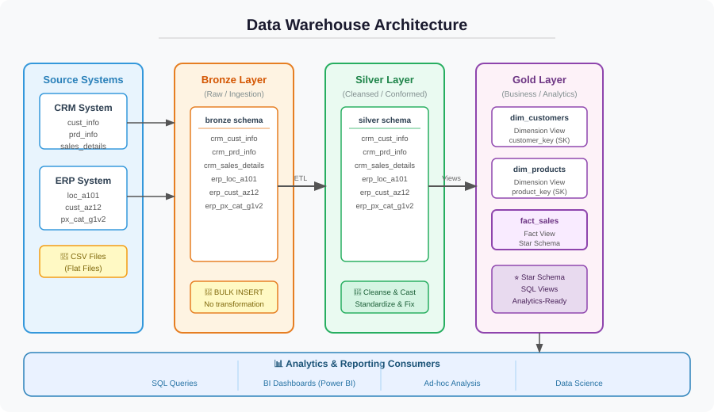
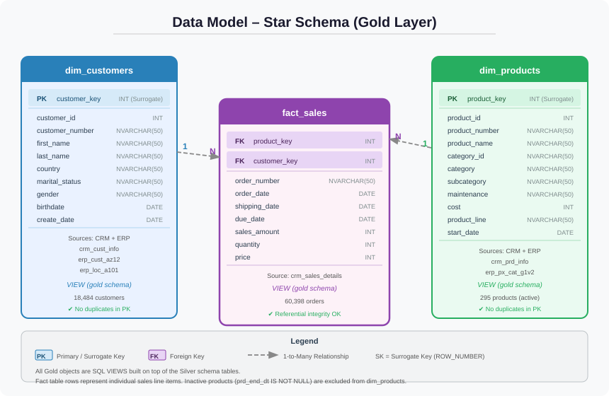

# SQL Data Warehouse and Analytics project
Building a modern SQL data warehouse with SQL server using ETL processes, Data Modeling  and alaytics

Welcome to the **Data Warehouse and Analytics Project** repository! 🚀
This project demonstrates an end-to-end data warehousing and analytics solution, covering everything from data ingestion and modeling to analytics and reporting. It is designed as a portfolio project that highlights best practices in data engineering and data analytics.

---

##  Project Overview
The goal of this project is to build a modern data warehouse using SQL Server to consolidate sales data from multiple source systems and enable insightful, business-ready analytics.
The project follows industry-standard approaches to:
- Data integration
- Data quality handling
- Analytical data modeling
- BI reporting

### Data Architecture
The warehouse follows a three-tier **Medallion Architecture**:

| Layer | Schema | Description |
|-------|--------|-------------|
| **Bronze** | `bronze` | Raw data ingested from source CSV files with no transformation |
| **Silver** | `silver` | Cleansed, type-cast, and standardised data ready for modelling |
| **Gold** | `gold` | Business-ready Star Schema views used directly for analytics |

### Data Model (Star Schema)
The Gold layer exposes a clean Star Schema consisting of two dimension views and one fact view:

## 🛠️ Project Requirements
1️⃣ **Building the Data Warehouse (Data Engineering)**
🎯 **Objective**
Develop a centralized data warehouse that consolidates sales data from multiple source systems to support analytical reporting and informed decision-making.

📌 **Specifications**
- data Sources
   - Import data from two source systems: ERP and CRM (provided as CSV files).
- Data Quality
   - Clean and resolve data quality issues before analysis (missing values, inconsistencies, duplicates, etc.).
- Data Integration
   - Combine data from both sources into a single, unified, analytics-friendly data model.
- Scope
   - Focus on the latest dataset only.
   - Historical data tracking is not required.
- Documentation
   - Provide clear and structured documentation of the data model to support business users and analytics teams.

---

2️⃣ **BI, Analytics & Reporting (Data Analytics)**
🎯 **Objective**
- Develop SQL based analytics and reports
- Analyze customer behavior and sales trends
- Evaluate product performance
- Enable data-driven business decisions

📄 **License**
This project is licensed under the [MIT License](License), You are free to use it and do the modification best suitable to you.

👤 **About Me**
I’m Vikas Pareek, an aspiring Data Analyst currently studying at SVNIT Surat.
I am passionate about working with data, building analytical solutions, and transforming raw data into actionable insights.
This project reflects my interest in data engineering, SQL analytics, and business intelligence, and represents my journey toward a career in data science and analytics.
